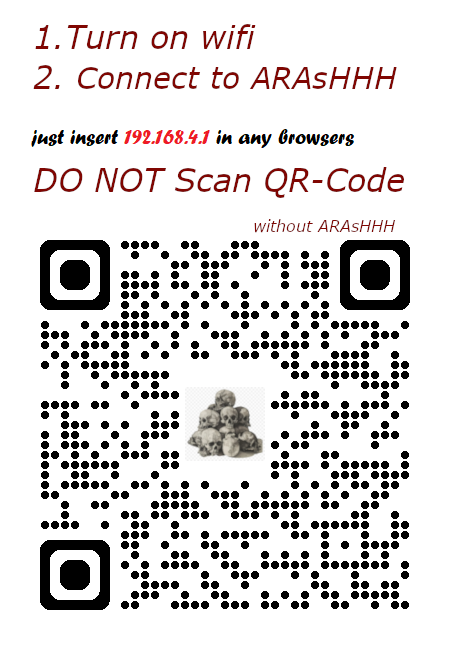

# ARAsHHH – ESP8266 WS2811/WS2812 LED Controller

A beautiful, lightweight, and rock‑solid Wi‑Fi LED strip controller built for the **ESP8266 (D1 Mini)**.  
No cloud, no app – just connect to the ESP’s Wi‑Fi and control your lights from any device’s browser.

## ✨ Features

- **Instant web control** – open `192.168.4.1` after connecting to the `ARAsHHH` Wi‑Fi
- **RGB colour picker** + **separate Red/Green/Blue sliders** for fine‑tuning
- **Live LED strip preview** that mirrors your real LEDs in real time
- **5 built‑in effects** – Static, Rainbow, Chase, Breathe, Palette Sweep
- **Adjustable brightness, speed, and LED count** – all with debounced sliders (no crashes)
- **No captive portal headaches** – just a simple QR‑code‑friendly access point
- **Super lightweight code** – stable days without reboot

## 🛠️ Hardware Requirements

- **ESP8266 board** (D1 Mini recommended)
- **WS2811 / WS2812 / WS2812B LED strip** (up to 300 pixels)
- 5 V power supply for the strip (the D1 Mini can be powered via USB, but power the strip separately for many LEDs)
- Jumper wires

## 🔌 Wiring

| D1 Mini (ESP8266) | LED Strip    |
|-------------------|--------------|
| `D4` (GPIO2)      | **DATA**     |
| `G` (GND)         | **GND**      |
| `5V` / `VIN`      | **VCC** (only if strip draws small current, otherwise external 5 V) |

⚠️ **Important:** Connect the LED strip’s **GND** to the D1 Mini’s **GND** even if you use a separate power supply.

## 📦 Required Arduino Libraries

Install via **Library Manager** (Sketch → Include Library → Manage Libraries):

- **Adafruit NeoPixel** by Adafruit
- **ESP8266WiFi** (included in ESP8266 board package)
- **ESP8266WebServer** (included)

**Board setup:** In Arduino IDE, select **“NodeMCU 1.0 (ESP‑12E Module)”** (or equivalent) with default settings.

## 🚀 Quick Start

1. **Download** the `.ino` file from this repository.
2. **Open it in Arduino IDE** and change these settings if needed:
   - `NUM_LEDS` – number of LEDs in your strip
   - `AP_SSID` – the Wi‑Fi name you want (default: `ARAsHHH`)
3. **Upload** the sketch to your D1 Mini.
4. **Power the D1 Mini** and the LED strip.
5. **Connect your phone/PC** to the Wi‑Fi network `ARAsHHH` (no password).
6. **Open your browser** and go to **`192.168.4.1`**.
7. **Control your lights!**

## 🎨 Using the Interface

- **LED Count** slider – set how many pixels your strip has (adjusts instantly)
- **Strip preview** – shows exactly what the real strip is doing
- **Colour picker** – pick any colour or use the R/G/B sliders below it
- **Effect buttons** – tap to switch between effects; the active one lights up
- **Brightness** & **Speed** – adjust in real time

All sliders are **debounced** – rapid dragging won’t overload the ESP and cause restarts.

## 📱 How to Make It Even Easier (QR Code)

1. **Print a QR code** that contains `http://192.168.4.1`.
2. Add a short instruction: *“Connect to ARAsHHH, then scan this code.”*
3. Users simply scan the code and the browser opens directly to the control page.

You can generate a QR code for free at [qr-code-generator.com](https://www.qr-code-generator.com/) or [qrcodemonkey.com](https://www.qrcodemonkey.com/).

## 🔧 Customisation

You can easily change:

- **Wi‑Fi name** – edit `#define AP_SSID "ARAsHHH"` near the top of the sketch
- **Wi‑Fi password** – set `#define AP_PASSWORD "yourpassword"` to secure the network
- **Default LED count** – change `#define NUM_LEDS 48` (you can still change it from the UI)
- **Default colour** – modify `strip.Color(255, 0, 0)` in `staticColor` to any RGB value
- **Data pin** – if you can’t use GPIO2 (D4), change `#define LED_PIN 2` to another GPIO number

## 🧹 Troubleshooting

**ESP restarts repeatedly?**
- Use a **stable 5 V power supply** (not just your computer’s USB) – a weak supply can cause brown‑out resets.
- If your strip has many LEDs, power the strip **externally** and only share ground with the D1 Mini.

**Can’t connect to the Wi‑Fi?**
- Make sure the D1 Mini is powered and the sketch uploaded successfully.
- The ESP creates an **open network** – if you don’t see `ARAsHHH`, check the serial monitor for error messages (baud rate 115200).

**Web page doesn’t load?**
- Ensure your device is connected to the `ARAsHHH` Wi‑Fi.
- Try opening **`http://192.168.4.1`** directly (some browsers hide the address bar on captive portals).

## 📄 License

This project is **MIT licensed** – feel free to use, modify, and share it.

---

Happy tinkering! ✨  
If you find this useful, give the repo a ⭐️!
